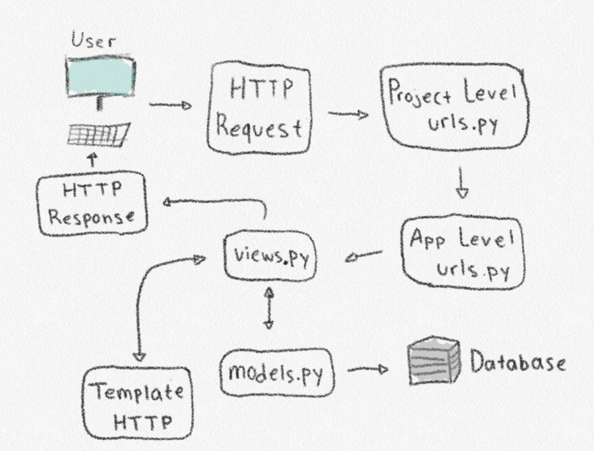
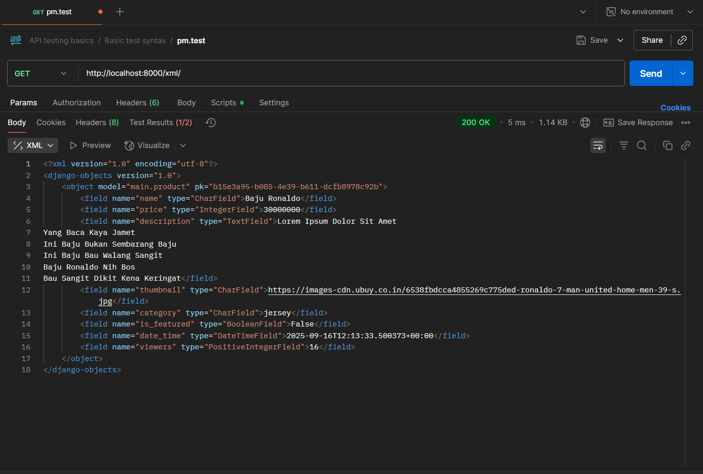
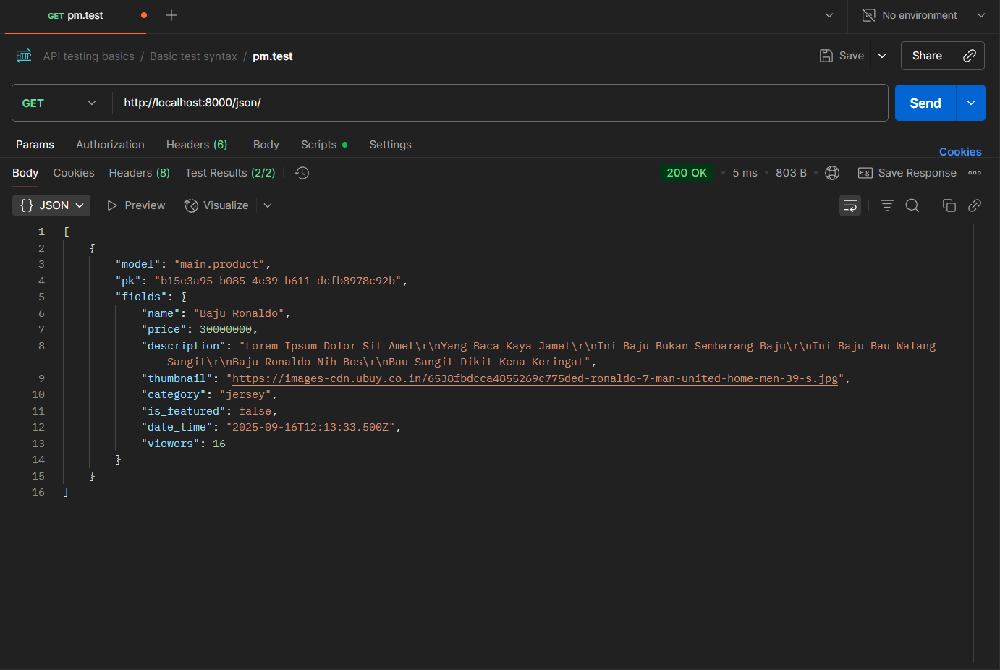
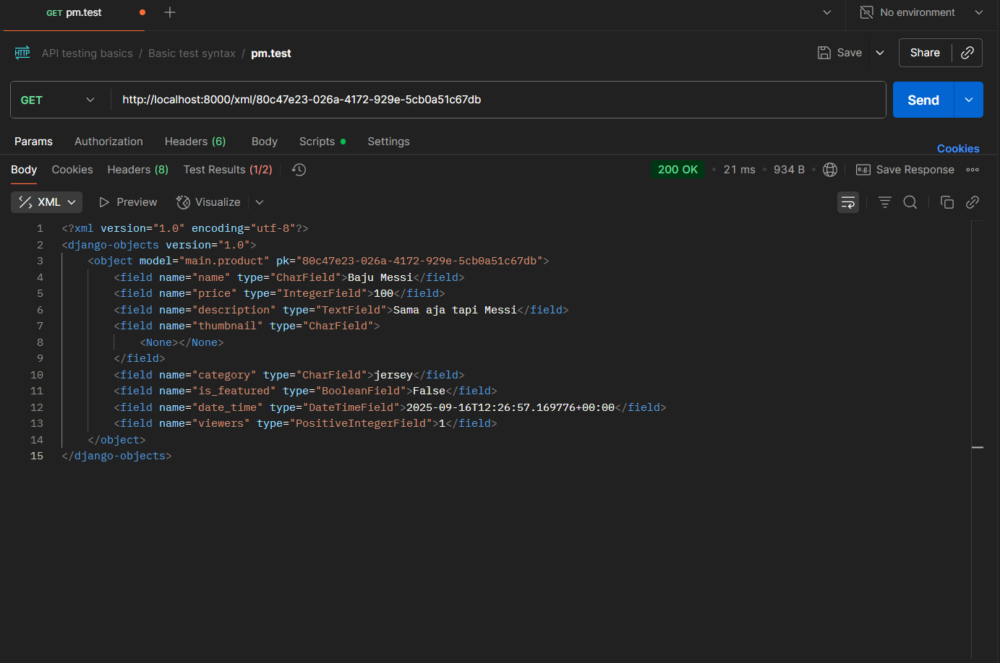
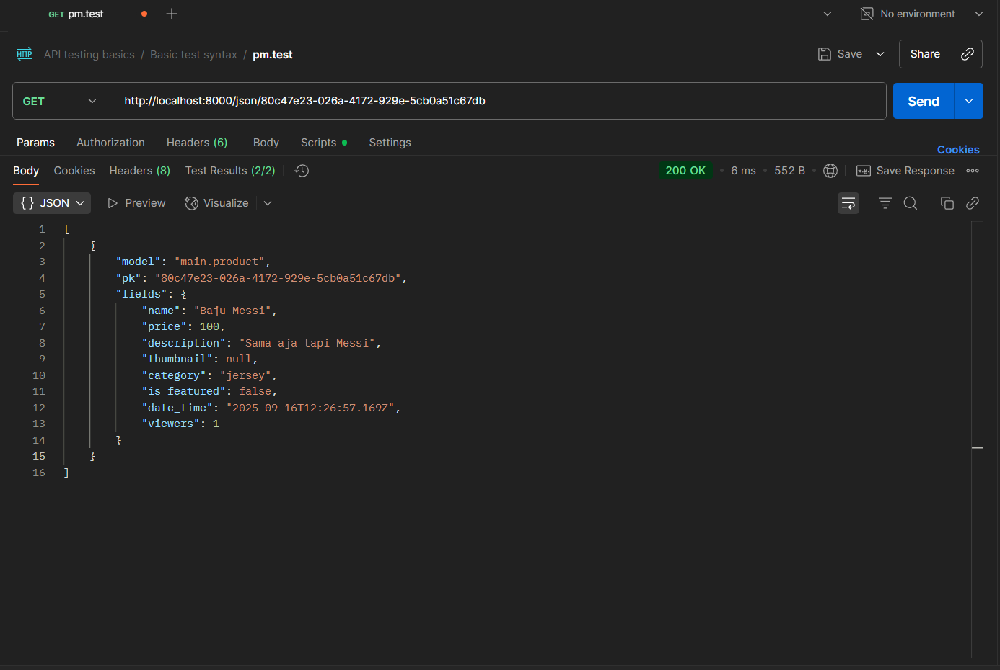

# 🔊 Horeg FC

<details>
<Summary><b>Tugas 2</b></Summary>

# Tugas 2
## 🛠️ Setup Git dan GitHub
1. Buka Terminal VSCode dan ketik `git clone <link>`
2. Buat branch utama baru bernama main dengan `git branch -M main`
3. Tambahkan folder .gitignore
4. Melakukan testing dengan 
    ```bash
    git add .
    git commit -m "tes komen"
    git push -u origin main

## 🐍 Setup Virtual Environment dan Django
1. Buka virtual environment dengan `python -m venv env`
2. Ketik `env\Scripts\activate`
3. Buat berkas bernama `requirements.txt` dan tambahkan beberapa dependencies
4. Install dengan `pip install -r requirements.txt`
5. Buat proyek Django `django-admin startproject horeg_fc .`
6. Buat file `.env` dan `.env.prod`
7. Modifikasi `settings.py`
8. Lakukan migrate dengan `python manage.py migrate`
9. Jalankan server Django dengan `python manage.py runserver`

## 🔧 Setting PWS
1. Buat project baru pada PWS
2. Ubah raw environmentnya menjadi sesuai dengan `.env.prod`
3. Tambahkan `ALLOWED_HOST` di `settings.py`
4. Jalankan informasi Project Command di PWS

## 📱 Setup Aplikasi `main`
1. Buat aplikasi baru bernama main dengan `python manage.py startapp main`
2. Masukkan `main` ke dalam proyek
3. Buat folder templates dan buat file bernama `main.html` di dalamnya
4. Ubah isi dari `models.py`
5. Lakukan migrasi dengan `python manage.py makemigrations` dan `python manage.py migrate`
6. Masukkan data di `views.py`
7. Modifikasi template

## 🌐 URL Routing
1. Buat berkas `urls.py` di dalam `main`
2. Import `include` di `angkringan_cyberpunk/urls.py` dan tambahkan
    ```bash
    path('', include('main.urls'))

## Project siap dijalankan!
Jalankan proyek dengan `python manage.py runserver`

## Routing bekerja dengan cara

`urls.py` mencocokan URL yang diakses browser dengan daftar path yang didefinisikan di file `urls.py`. Apabila cocok, request akan diarahkan ke view yang sesuai.

Setelah menerima request dari `urls.py`, `views.py` akan mengambil atau memodifikasi data di `models.py` jika perlu. Lalu mengirim data ke `Template` untuk dirender menjadi `HTML`. Hasil render tersebut yang menjadi `HTTP Response` dan dikirim kembali ke user.

`models.py` berfungsi sebagai tempat untuk mendefinisikan tabel `database` dalam bentuk class Python. Django bisa mengambil, mengubah, atau bahkkan menyimpan data di `database` tanpa pakai query SQL secara langsung. Models biasanya dipakai oleh `views.py` untuk mengambil atau menyimpan data, tetapi tidak berhubungan langsung dengan template ataupun URL.

Berkas `HTML` atau template `HTML` adalah berkas berisi tampilan halaman web. Namun, template tidak bisa mengambil datanya sendiri, semua data dikirim dari `views.py`, lalu views membuat `HTTP Response` dan dikirim ke browser

## Peran `settings.py` dalam proyek Django
Secara garis besar settings.py berguna untuk mengatur proyek Django yang digunakan.
Contohnya seperti `ALLOWED_HOST` untuk mengatur host/domain yang boleh mengakses aplikasi.
Lalu ada `Database` yang berfungsi ke dalam dua jalur, yaitu jika `PRODUCTION` bernilai `True`, Django akan menggunakan model `PostgreSQL`. Namun, jika `PODUCTION` bernilai `False`, Django akan menggunakan `SQLite`

## Cara kerja migrasi di database Django
Setiap perubahan di models.py harus dimigrasi. Migrasi bekerja dengan menyamakan bentuk database dengan model yang dibuat di models.py. Saat mengubah models.py, Django akan membuat file migrasi dengan `python manage.py makemigrations`. Setelah itu, jalankan `python manage.py migrate` agar menerapkan perubahan itu langsung ke Database.

## Alasan Django dijadikan permulaan pembelajaran
Django sudah menyediakan banyak fitur bawaan sehingga tidak perlu mengatur semuanya dari awal. Dengan Django, kita bisa langsung belajar konsep inti pengembangan perangkat lunak, seperti MVT. Hal ini membuat Django cocok dijadikan framework awal untuk memahami cara kerja pengembangan aplikasi yang terstruktur.

## Feedback untuk Asdos Tutorial 1
Tidak ada, kebetulan tutorial 1 tidak menemukan kesulitan
</details>
<details>
<Summary><b>Tugas 3</b></Summary>

# Tugas 3
1. Buat file `forms.py`
    ```bash
    from django.forms import ModelForm
    from main.models import Product

    class NewsForm(ModelForm):
        class Meta:
            model = Product
            fields = ["name", "description", "category", "thumbnail", "is_viral"]
2. Menambahkan beberapa import pada `views.py`
3. Menambahkan variable `products_list` dan fungsi baru pada `views.py`
4. Menambahkan import fungsi yang sudah dibuat tadi pada `urls.py` di direktori main
5. Tambahkan path URL ke dalam `urlpatterns`
6. Ubah `main.html` agar bisa menampilkan data dan add new product yang akan muncul di halaman form
7. Buat file baru bernama `add_product.html`, yang berisikan token security dan template tag
8. Buat file baru bernama `product_detail.html`
9. Tambahkan `CSRF_TRUSTED_ORIGINS` di dalam `settings.py`


1. Import `HttpResponse` dan `Serializer` di views.py
2. Tambahkan fungsi `show_xml` dan `show_json` di `views.py`
3. Tambahkan import `show_xml` dan `show_json` di `urls.py`
4. Tambahkan path `path('xml/', show_xml, name='show_xml')` dan `path('json/', show_json, name='show_json')` di `urlpatterns`
5. Tambahkan fungsi `show_xml_by_id` dan `show_json_by_id` di views.py
6. Untuk by id, gunakan blok try and catch agar diteruskan ke error code 404 jika terjadi error
7. Tambahkan importnya di `urls.py`
8. Tambahkan pathnya di `urlspatterns`

## Mengapa kita memerlukan data delivery dalam pengimplementasian sebuah platform?
Data delivery berguna untuk menyalurkan data dari sumber, seperti database, server, dan lainnya ke pengguna yang membutuhkan.
Data delivery memastikan data bergerak dari sumber ke pengguna dengan cepat, aman, dan konsisten.
Tanpa data delivery, platform mungkin akan mengalami masalah kinerja, keamanan, dan lainnya yang mengakibatkan turunnya kualitas layanan bagi pengguna

## Lebih baik XML atau JSON? Mengapa JSON lebih populer?
Menurut saya lebih baik JSON, karena tata bahasa yang digunakan mirip Java Script dan dia menggunakan seperti dictionary. Perbedaannya dengan dictionary adalah key di JSON harus string.
Selain itu, JSON juga lebih mudah dibaca dibandingkan dengan XML

## Fungsi dari method is_valid()
Method `is_valid()` berguna untuk memvalidasi data yang dikirim oleh form, misalnya seperti mengecek field yang seharusnya menerima sebuah integer, form ternyata menerima string alphabet. Jika string angka, method `is_valid` akan mengubahnya menjadi integer
Contoh untuk price sebuah IntegerField, jika user memasukkan sebuah integer maka `is_valid()` akan mengembalikan `True`
    
## Mengapa butuh csrf_token pada form Django? Apa yang terjadi jika tidak menambahkan csrf_token? Bagaimana hal tersebut bisa dimanfaatkan penyerang?
CSRF adalah token unique yang dibuat oleh Django untuk melindungi form dari serangan CSRF (Cross-Site Request Forgery)
Jika tidak menambahkan token, penyerang bisa menjalankan aksi seperti mengubah password atau menghapus data
Penyerang membuat halaman berbahaya yang mengirim request POST ke target, browser korban mengikutsertakan cookie login tanpa disadari

## Step by step
Saya mengikuti sedikit dari tutorial (karena beberapa data tidak terlalu perlu diubah/berbeda) dan mencoba-coba untuk htmlnya. Menghadapi trials dan errors karena models kekurangan attributes yang cukup diperlukan

## Pesan untuk asdos
tidak ada

## Postman Screenshot
1. XML


2. JSON


3. XML with ID


4. JSON with ID

</details>
<details>
<Summary><b>Tugas 4</b></Summary>

# Tugas 4
1. Import di `views.py`
    ```python
    from django.contrib import messages
    from django.contrib.auth.forms import UserCreationForm, AuthenticationForm
    from django.contrib.auth import authenticate, login, logout
2. Tambahkan fungsi `register`, `login_user`, dan `logout_user` di `views.py`
3. Buat file `register.html` dan `login_html`
4. Tambahkan tombol logout di `main.html`
5. Import kedua fungsi tersebut di `urls.py` lalu tambahkan path
    ```python
    path('register/', register, name='register'),
    path('login/', login_user, name='login'),

1. Import di `views.py`
    ```python
    import datetime
    from django.http import HttpResponseRedirect
    from django.urls import reverse
    from django.contrib.auth.decorators import login_required
2. Tambahkan `@login_required(login_url='/login')` di atas `show_main` dan `show_product`
3. Ubah fungsi `login_user` untuk set cookie `last_login`
4. Set fungsi `logout_user` agar menghapus cookie `last_login`
5. Tambahkan `last_login` di dalam context dari fungsi `show_main`
6. Tampilkan informasi tentang `last_login` di `main.html`

1. Import `from django.contrib.auth.models import User` di `models.py`
2. Pada `models.py`, tambahkan `user = models.ForeignKey(User, on_delete=models.CASCADE, null=True)` di awal class Product
3. Jalankan `makemigration` dan `migrate`
4. Ubah `add_product` menjadi
    ```python
    def add_product(request):
    form = ProductForm(request.POST or None)

    if form.is_valid() and request.method == "POST":
        products_entry = form.save(commit=False) # Save tapi belum disimpan di database
        products_entry.user = request.user # Ubah "user" dari data product dengan user yang sedang login
        products_entry.save() # Simpan di database
        return redirect('main:show_main')

    context = {'form': form}
    return render(request, "add_product.html", context)
5. Ubah `show_main` untuk dapat memfilter produk milik user atau milik semua orang
6. Tambahkan tombol untuk melihat filter tersebut di `main.html` serta menampilkan nama author di `product_detail.html`

## Apa itu Django AuthenticationForm? Jelaskan juga kelebihan dan kekurangannya.
Django AuthenticationForm berfungsi untuk menangani proses autentikasi pengguna, dengan cara memverifikasi username dan password pengguna yang dimasukkan saat mereka ingin login ke dalam web. Django membuat AuthenticationForm dalam bentuk Form yang secara otomatis sudah menyertakan validasi dasar untuk username dan password.

Kelebihan dari Django AuthenticationForm adalah kemudahannya dalam penggunaan. Kemudahan yang dimaksud adalah kita tidak perlu untuk membuat form autentikasi dari awal, cukup gunakan yang sudah disediakan dari Django tersebut. Selain itu, validasi dasarnya sangat membantu. Form ini akan memeriksa apakah username dan password terisi dan valid.
Namun, Django AuthenticationForm juga tidak luput dari kekurangan. Salah satu kekurangannya adalah keterbatasan kostumisasi. Formulir hanya dapat mendukung bidang username dan password saja. Jika ingin menambahkan bidang lain, seperti email, kita harus membuat form kustom yang baru dari Form atau ModelForm

## Apa perbedaan antara autentikasi dan otorisasi? Bagaiamana Django mengimplementasikan kedua konsep tersebut?
Autentikasi secara garis besar berarti memvalidasi user dengan passwordnya, seperti saat login. Sedangkan, Otorisasi berguna untuk menentukan hak akses dari pengguna. Django mengimplementasikan kedua konsep ini melalui `django.contrib.auth`. Contoh autentikasi adalah seperti model User, seperti `UserCreationForm()` ini merupakan contoh autentikasi dengan juga mengecek `form.is_valid`. Jika autentikasi berhasil, maka program akan lanjut `login(request, user)`. Lalu, untuk otorisasi, Django mengimplementasikannya dengan `@login_required`, yang berarti jika fungsi tersebut ingin dijalankan, maka harus login terlebih dahulu

## Apa saja kelebihan dan kekurangan session dan cookies dalam konteks menyimpan state di aplikasi web?
Kelebihan cookies adalah dia bisa bertahan meskipun browser sudah ditutup, yang artinya jika pengguna sudah melakukan login di suatu situs dan tidak melakukan logout, kemudian browser ditutup, ketika dibuka kembali pengguna masih dalam kondisi login. Kekurangannya ada di ukurannya yang kecil, juga rentan terhadap serangan seperti XSS.
Kelebihan session terdapat pada keamanannya karena data asli terdapat di server dan tentunya bisa menyimpan data dalam jumlah yang besar. Namun, kekurangan dari session adalah penggunaan memori server untuk setiap sesi aktif. Selain itu, session juga sangat bergantung pada cookies agar dapat berfungsi dengan baik. Contoh kekurangan session ketika pada suatu web yang terdapat 100,000 pengguna yang sedang aktif. Semua pengguna melakukan penyimpanan data seperti login, masukin barang ke keranjang, atau lainnya, mengakibatkan memori server dapat terisi dengan cepat, sehingga server jadi tidak responsif ataupun bisa crash.

## Apakah penggunaan cookies aman secara default dalam pengembangan web, atau apakah ada risiko potensial yang harus diwaspadai? Bagaimana Django menangani hal tersebut?
    Secara default, penggunaan cookies dalam pengembangan web tidak sepenuhnya aman. Risiko potensial yang umumnya diwaspadai pada cookies adalah XSS, di mana penyerang dapat mengambil cookie dari browser korban. Django sudah menangani keamanan cookies, salah satunya seperti menerapkan token CSRF. Token ini disimpan ke dalam cookies serta di dalam halaman web.

</details>
<details>
<Summary><b>Tugas 5</b></Summary>

1. Karena sudah ada tombol Delete, tujuan selanjutnya buat tombol Edit
2. Tambahkan fungsi `edit_product` di dalam `views.py`
    ```python
    def edit_product(request, id):
        product = get_object_or_404(Product, pk=id)
        form = ProductForm(request.POST or None, instance=product)
        if form.is_valid() and request.method == "POST":
            form.save()
            return redirect('main:show_main')
        
        context = {
            'form' : form
        }

        return render(request, "edit_product.html", context)
3. Import `edit_product` di `urls.py` serta tambahkan `path('news/<uuid:id>/edit', edit_product, name='edit_product')` di urlpatterns
4. Buat file `edit_product.html` dengan isi kurang lebih sama seperti `add_product`
5. Buat folder `templates` di direktori utama lalu buat file `navbar.html`
6. Masukkan `` di semua file html yang menggunakan navbar
7. Ubah styling pada semua html jika diperlukan
</details>